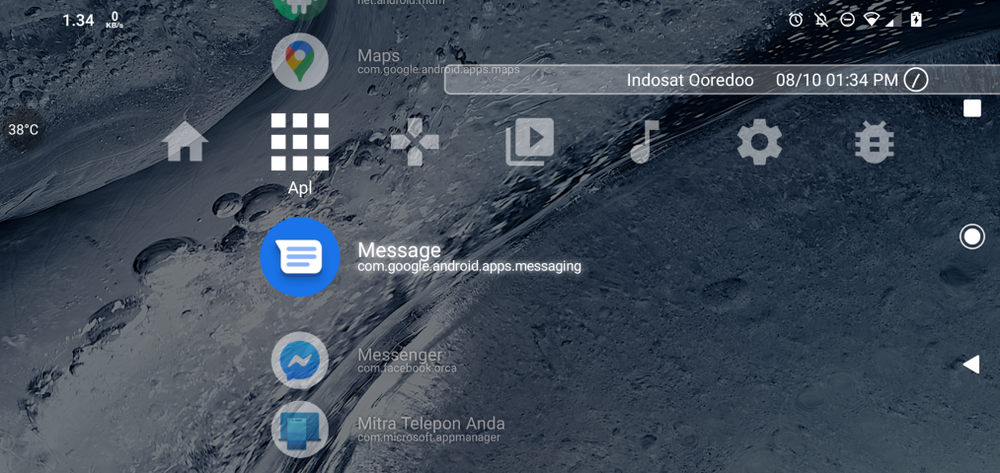
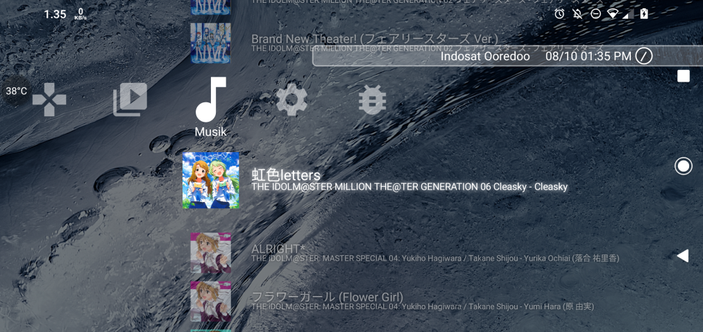
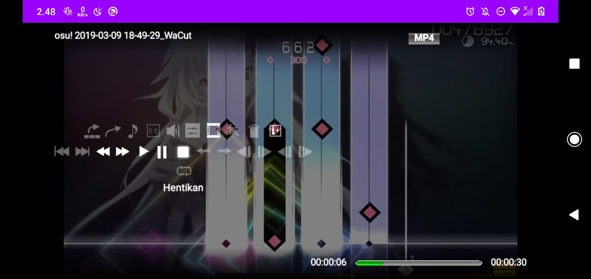

Language : English | [Bahasa Indonesia](README_ID.md)
# Cross Launcher
Sony XMB like Android Launcher, Mainly inspired by Sony PlayStation 3(TM) XMB.

## ⚠ Hiatus Notice ⚠
I cannot work on this project for very often as the company I'm working at currently have a very thigh schedule for projects, be it app or games. 
And sometime I lost my mood to work in this project when I have free time. Please understand that this project is my own side-project. 
There is probably a time that I may forgot this project at all.

## Main Focus
This launcher is not really focused to Android touch-based devices, But for Android devices that 
naturally doesn't have a native touch interface like TV, PC, Laptop, and Emulators.

The launcher is still fairly usable on Phones. Just with a bit struggle if you have a
lot of apps to navigate.

**You must've known that there is non-touch screen Android devices. Do not go toxic with your stupidity!**

## Usage
| Function          | Keyboard | DualShock | Xbox     | Touch            |
|-------------------|----------|-----------|----------|------------------|
| Navigate Items    | Arrow Pad| D-Pad     | D-Pad    | Swipe            |
| Execute Item      | Enter    | X/O       | A/B      | Icon touch       |
| Hide/Show Options | Menu/Tab | Triangle  | Y        | Two-finger Touch |

## Memory Usage
On my test devices, Base memory usage (without items) is about 10MB.
With about 500Kb~1MB per item since icons will be cached in memory.

18/11/2020: Icon bitmap loading is more dynamic now, but possibly caused hiccups when
an icon is first drawn on screen after hidden before

## Screenshots

App List

Music List

Video Player

## Progress
see [Main Project](https://github.com/EmiyaSyahriel/CrossLauncher/projects/1)

## Animation Modding
You can modify the Launcher Startup / App Launch Animation and Sound by
adding/changing files in `/sdcard/Android/data/id.psw.vshlauncher/files/`.
| File name    | Correspond to   |
|--------------|-----------------|
| coldboot.png | Startup logo    |
| coldboot.mp3 | Startup Audio   |
| gameboot.png | App launch logo |
| gameboot.mp3 | App launch audio|

## Releases
You can build it yourself, Or go to [Release](https://github.com/EmiyaSyahriel/CrossLauncher/releases)
page for pre-built packages

## Contribution
Translations and fixes are welcome.

## Building
### Prerequisites
- Android Studio with:
    - Android SDK 29+
    - NDK 21+
    - CMake 3.8+
- .NET Scripting tool (Build script only, optional)
    - .NET Core 3.1 (.NET 5.0 is recommended)
### Steps
- Clone or Download this repository
- Open Android Studio

To compile without the entire Android Studio package, please refer to this page : 
[Build your app from the command line | Android Developers](https://developer.android.com/studio/build/building-cmdline)
However, you would still need the Android SDK, NDK, CMake and optionally .NET Scripting tool.

## License
The main project is licensed under MIT License.
Some build-helper tool files is licensed under CC0 Public Domain.