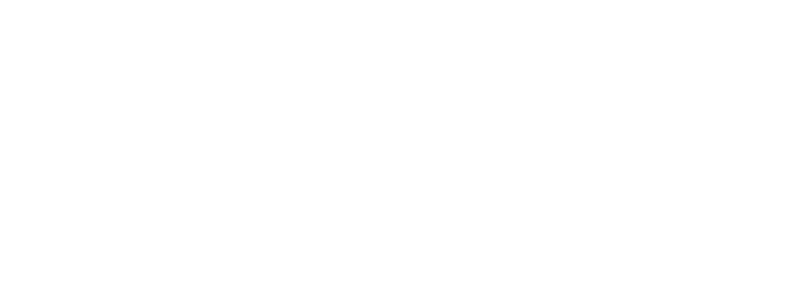
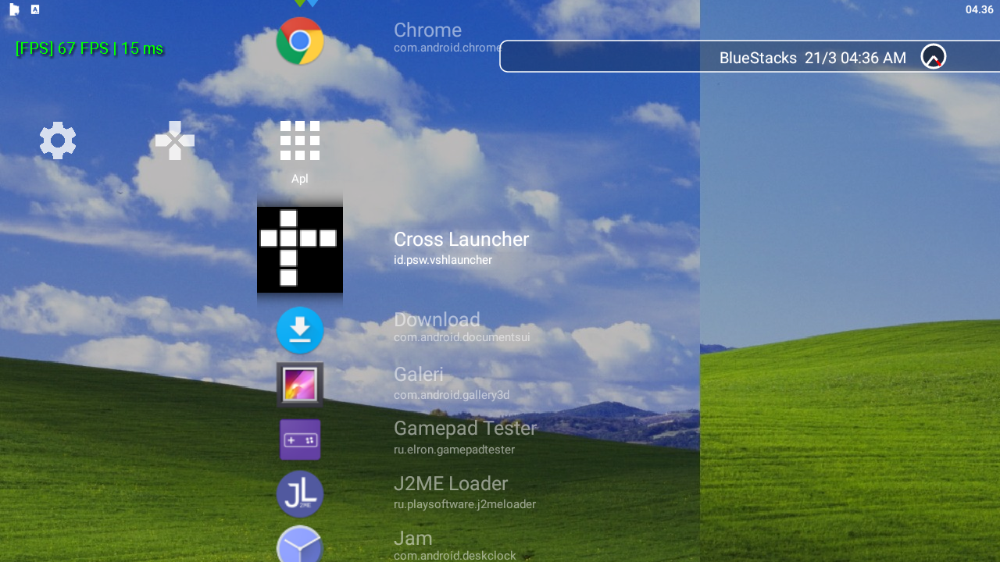
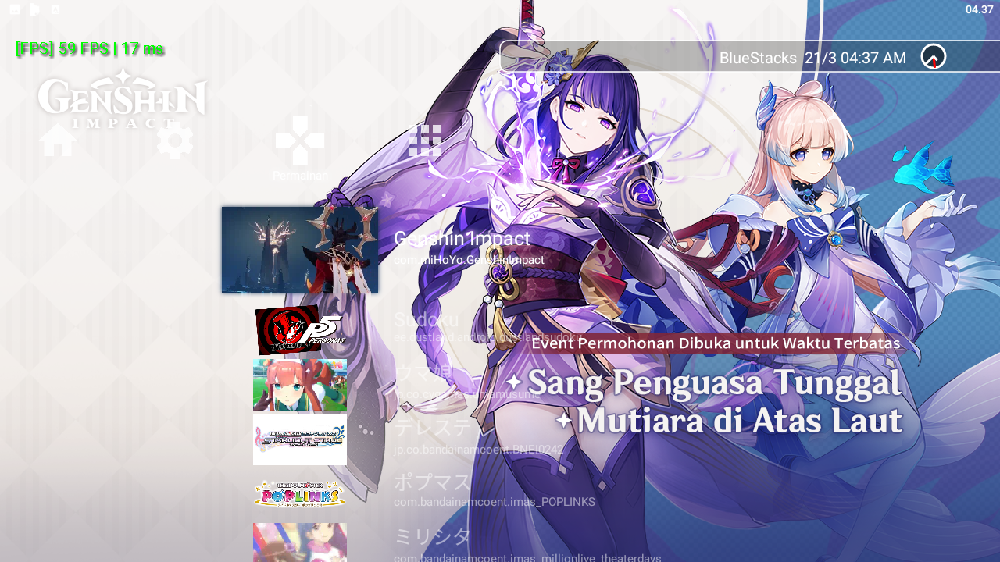
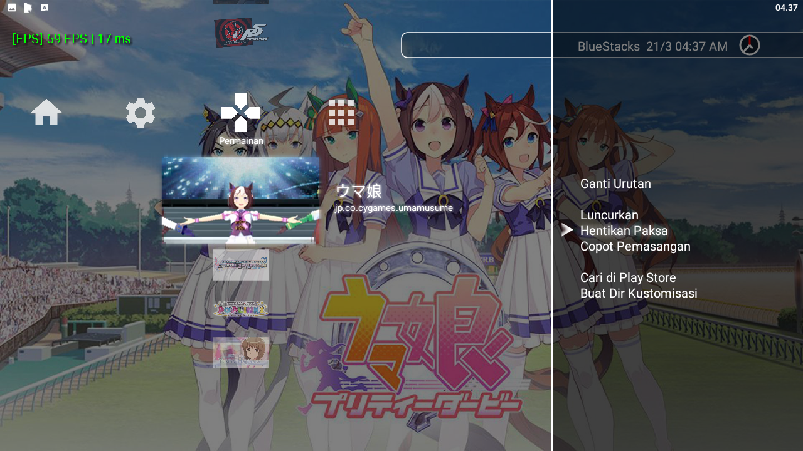
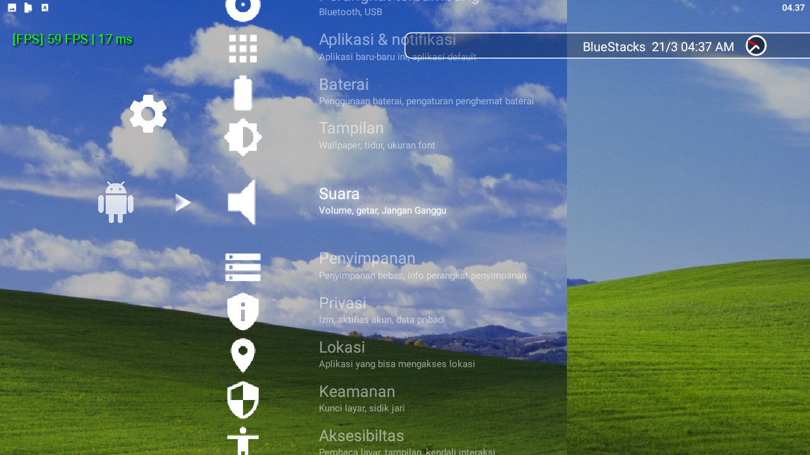

[Baca dalam Bahasa Indonesia](README_ID.md)

## **⚠ Warning! ⚠**
This app is in heavy alpha stage development and therefore not really stable! If you have
technical issue like crash or system bug, Please refer to [this page](https://github.com/EmiyaSyahriel/CrossLauncher/wiki/Error-Reporting)

## Main Focus
This launcher is not really focused to be used on touch-screen Android, it's mostly targeted
for devices that uses physical navigation like Gamepad, TV Remote or Keyboard.

The launcher is still fairly usable on touch screen. Just with a bit struggle if you have a
lot of apps to navigate.

## Memory Usage
08/07/2023 : Normally, at least on my Nokia T20, It should require around 50MB to 200MB of RAM, depending on :
- Count of icons currently displayed (animated icon is obviously uses larger RAM)
- Is currently playing audio file
- How many layer of backdrop is now showing (currently only max 1 layer, the backdrop)
- The resolution of the each backdrop
- Any leak is there?

## Screenshots

## Progress
see [Main Project](https://github.com/EmiyaSyahriel/CrossLauncher/projects/1)

## Supported customizations
see [Supported customization](https://github.com/EmiyaSyahriel/CrossLauncher/wiki/Customization)

## Download
There is 2 type of download now:
- [Action Build](https://github.com/EmiyaSyahriel/CrossLauncher/actions/workflows/android.yml)
  - Not really stable most of the time
  - Updated every time a new code is pushed to repository
  - Debug only, not for everyday use.
  - How to download
    - Select latest workflow with green check
    - Open Summary (opened by default)
    - Go to lowermost part, where it says *Artifacts*
    - Download the APK
- [Stable Release](https://github.com/EmiyaSyahriel/CrossLauncher/releases)
  - Stable, at least more than Action Build version
  - Updated less frequently
  - Have both Release and Debug

Or you can build it yourself, see [Building](https://github.com/EmiyaSyahriel/CrossLauncher/wiki/Contributing-and-Building-the-App#building) on repo's wiki pages.

## Building
see [Building](https://github.com/EmiyaSyahriel/CrossLauncher/wiki/Contributing-and-Building-the-App#building) on repo's wiki pages.

## Contribution
Translations and fixes are welcome. How to contribute is [explained here](https://github.com/EmiyaSyahriel/CrossLauncher/wiki/Contributing-and-Building-the-App#for-contribution-work).

There is also an Extension System planned, so anyone can develop a plugin to provide additional feature to CrossLauncher.

## License
The main project is licensed under MIT License.
Some build-helper tool files is licensed under CC0 Public Domain.
