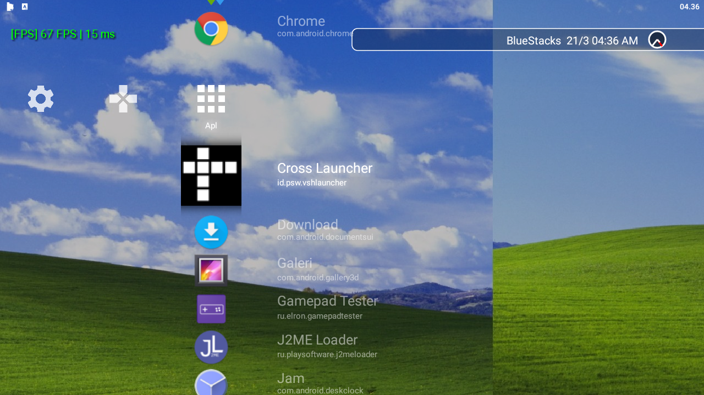
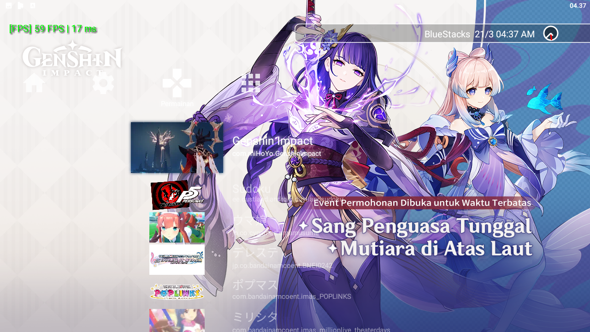
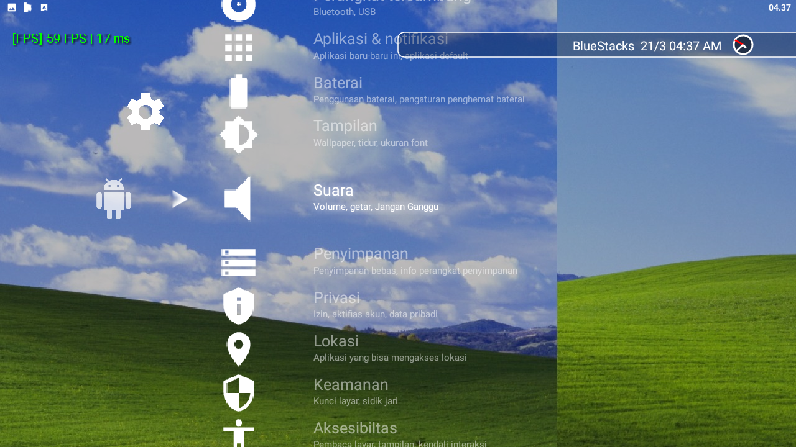

# Cross Launcher
Peluncur Aplikasi Android mirip XMB pada beberapa produk Sony, terutama XMB PlayStation 3.

[Read in English](README.md)

> [!WARNING]
> Aplikasi sedang dalam fase alpha dan sedang dalam pengembangan besar, sehingga tidak terlalu stabil! Jika
> anda mengalami crash atau bug sistem, silahkan merujuk [ke halaman ini (Bahasa Inggris)](https://github.com/EmiyaSyahriel/CrossLauncher/wiki/Error-Reporting)

## Fokus Utama
Launcher ini tidak benar-benar ditujukan kepada perangkat Android layar sentuh, Tetapi untuk perangkat
Android yang normalnya tidak memiliki antarmuka sentuh seperti TV, Komputer, Laptop atau Emulator.

Peluncur ini masih bisa dipakai pada perangkat Android layar sentuh, hanya saja akan memerlukan usaha
lebih untuk navigasinya.

## Penggunaan RAM
Pada perangkat tes saya, aplikas kosongan biasa memakan RAM sekitar 10MB, ditambah ikon yang dimuat sekitaran 
500kB~1MB per ikon. Ikon akan tetap berada pada RAM selama launcher berjalan.

18/11/2020: Pemuatan ikon sekarang lebih dinamis. Mungkin akan ada lag sedikit ketika ikon masuk layar

20/03/2022: Untuk sekarang, launcher ini membutuhkan RAM yang cukup banyak, di perangkat tes saya yang 
terpasang ~75 ikon peluncuran (cukup banyak memang), memerlukan sekitar 512-700 MB meskipun dengan manajemen bitmap yang cukup
ketat.

## Tangkapan Layar

## Progress
Lihat [Main Project](https://github.com/EmiyaSyahriel/CrossLauncher/projects/1)

## Kustomisasi
Lihat [Supported customization](https://github.com/EmiyaSyahriel/CrossLauncher/wiki/Customization)

## Download
[👉 Dimari gan 👈](https://github.com/EmiyaSyahriel/CrossLauncher/releases), atau silahkan coba 
build sendiri.

## Build Mandiri
### Syarat
- Android Studio, dengan:
    - Android SDK 29+
    - NDK 21+
    - CMake 3.8+
- .NET Scripting tool (Opsional, Hanya sebagai script build)
    - .NET Core 3.1 (.NET 5.0 direkomendasikan)

### Langkah
- Clone atau download repositori ini
- Buka direktori projek ini di Android Studio
- Build

Untuk mengkompilasi tanpa Android Studio, silahkan mengunjungi halaman:
[Build your app from the command line | Android Developers](https://developer.android.com/studio/build/building-cmdline)
Tapi, anda masih akan memerlukan Android SDK, NDK, CMake dan, untuk tambahan saja, .NET Scripting tool.

.NET Scripting tool dipakai untuk mengubah sumber daya C++ ke kode sumber C++, dalam projek ini hanya
terpakai jika anda mengubah berkas sumber daya seperti berkas kode sumber shader (file `frag` dan `vert`) dan lain-lain.

## Kontribusi
Bantuan dalam bentuk terjemahan dan perbaikan dalam kode dipersilahkan.

## Lisensi
MIT License.
Beberapa file alat bantu build ada dibawah Domain Publik CC0 